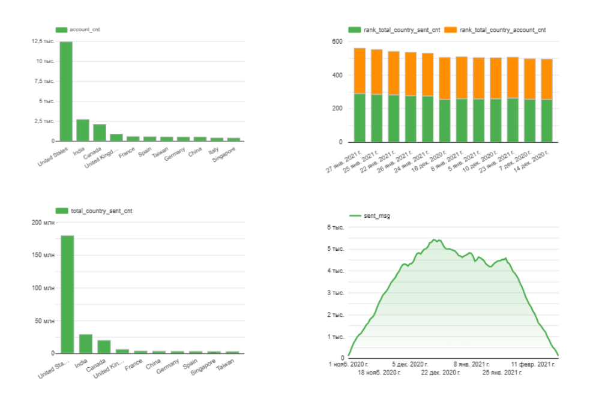

# 📊 Оптимізація глобальної стратегії email-маркетингу та сегментація користувачів

**Роль:** Data Analyst  
**Інструменти та технології:** SQL (BigQuery / GoogleSQL), аналітичні віконні функції (`DENSE_RANK`, `SUM OVER`), CTE (Common Table Expressions), Data Blending (об'єднання даних сесій та транзакційних логів).

---

## 📌 1. Опис проєкту та бізнес-контекст
Для будь-якого продуктового бізнесу email-маркетинг є одним із головних інструментів утримання користувачів (Retention) та повторних продажів. Проте хаотичні або занадто часті розсилки по всій базі без урахування географії та налаштувань акаунтів призводять до вигорання аудиторії, зростання спам-репортів та марнування маркетингового бюджету.

**Мета проєкту:** побудувати аналітичний пайплайн, який об'єднує продуктові сесії з логами маркетингової платформи. Це дозволяє структурувати воронку комунікацій, виділити Топ-10 ключових ринків за обсягом та активністю аудиторії, а також знайти оптимальні паттерни взаємодії з клієнтами для зниження відтоку (Churn Rate).

---

## 🛠 2. Технічні завдання, реалізовані в запиті
- **Об'єднання різнорідних джерел даних (Data Blending):** Зв'язано продуктові метрики (сесії користувачів із Google Analytics та параметри їхніх акаунтів) з логами маркетингової платформи (відправлення листів, відкриття та кліки).
- **Агрегація за допомогою `UNION ALL`:** Поєднано в одну структуру дані про реєстрації/активність акаунтів та події маркетингової воронки, що дозволило уникнути дублювання рядків та роздування бази даних.
- **Когортне зміщення часу (Time-series alignment):** Використано функцію `date_add`, щоб скоригувати дату взаємодії з листом (відкриття/візит) відносно базової дати створення чи активності акаунту.
- **Просунуте ранжування віконними функціями:** Застосовано `SUM() OVER` для підрахунку глобальних тоталів по країнах, а за допомогою `DENSE_RANK()` реалізовано динамічний відбір лише Топ-10 ринків за двома різними метриками одночасно (кількість клієнтів та обсяг відправлених повідомлень).

---

## 📈 3. Результати та візуалізація

На основі вивантажених цим запитом даних побудовано дашборд, який відображає динаміку маркетингової воронки (`Sent` → `Open` → `Visit`) та поведінку користувачів у часі.



*Аналітична матриця дозволяє оцінювати ефективність розсилок як на макрорівні (по країнах), так і в мікророзрізах (статус верифікації профілю, обраний користувачем інтервал розсилки).*

---

## 🎯 4. Бізнес-цінність та прийняття рішень

1. **Фокус на високорентабельних ринках (Geo-targeting & Budget Optimization):** Завдяки фільтрації Топ-10 країн бізнес фокусує бюджети та зусилля з локалізації контенту на ринках із найвищим потенціалом повернення інвестицій (ROI).
2. **Оптимізація конверсій маркетингової воронки (CRO):** Моніторинг метрик **Open Rate (OR)** та **Click-To-Open Rate (CTOR)** допомагає оцінити якість тем листів та релевантність закликів до дії (CTA).
3. **Утримання аудиторії та зменшення відтоку (Churn Mitigation):** Аналіз відписок (`is_unsubscribed`) у розрізі інтервалів (`send_interval`) допомагає визначити оптимальну частоту комунікацій.
4. **Контроль якості вхідного трафіку (Lead Quality Assessment):** Сегментація за статусом `is_verified` показує якість підтверджених профілів та підказує потребу впровадження Double Opt-In.

---

## 💻 5. SQL-код проєкту
Повний SQL-скрипт доступний у файлі [`email_marketing_analytics.sql`](./email_marketing_analytics.sql).

<details>
<summary><b>Натисніть, щоб розгорнути SQL-код</b></summary>

```sql
WITH
base_account as (
  SELECT
    s.date,
    sp.country,
    acc.send_interval,
    acc.is_verified,
    acc.is_unsubscribed,
    acc.id AS account_id
  FROM `data-analytics-mate.DA.session` AS s
  JOIN `data-analytics-mate.DA.session_params` AS sp ON s.ga_session_id = sp.ga_session_id
  JOIN `data-analytics-mate.DA.account_session` AS ass ON s.ga_session_id = ass.ga_session_id
  JOIN `data-analytics-mate.DA.account` AS acc ON ass.account_id = acc.id
),
metrics AS (
  SELECT
    ba.date, ba.country, ba.send_interval, ba.is_verified, ba.is_unsubscribed,
    COUNT(DISTINCT account_id) AS account_cnt,
    0 AS sent_msg, 0 AS open_msg, 0 AS visit_msg
  FROM base_account AS ba
  GROUP BY ba.date, ba.country, ba.send_interval, ba.is_verified, ba.is_unsubscribed
  UNION ALL
  SELECT
    date_add(ba.date, INTERVAL sent_date DAY),
    ba.country, ba.send_interval, ba.is_verified, ba.is_unsubscribed,
    0 AS account_cnt,
    COUNT(DISTINCT es.id_message) AS sent_msg,
    COUNT(DISTINCT eo.id_message) AS open_msg,
    COUNT(DISTINCT ev.id_message) AS visit_msg
  FROM base_account AS ba
  JOIN `data-analytics-mate.DA.email_sent` AS es ON ba.account_id = es.id_account
  LEFT JOIN `data-analytics-mate.DA.email_open` as eo ON es.id_message = eo.id_message
  LEFT JOIN `data-analytics-mate.DA.email_visit` AS ev ON es.id_message = ev.id_message
  GROUP BY date_add(ba.date, INTERVAL sent_date DAY), ba.country, ba.send_interval, ba.is_verified, ba.is_unsubscribed
),
combined_data AS (
  SELECT
    date, country, send_interval, is_verified, is_unsubscribed,
    SUM(account_cnt) AS account_cnt,
    SUM(sent_msg) AS sent_msg,
    SUM(open_msg) AS open_msg,
    SUM(visit_msg) AS visit_msg
  FROM metrics
  GROUP BY date, country, send_interval, is_verified, is_unsubscribed
),
final_with_totals AS (
  SELECT *,
    SUM (account_cnt) OVER (PARTITION BY country) AS total_country_account_cnt,
    SUM (sent_msg) OVER (PARTITION BY country) AS total_country_sent_cnt
  FROM combined_data
),
ranked_data AS (
  SELECT *,
    DENSE_RANK() OVER (ORDER BY total_country_account_cnt DESC) AS rank_total_country_account_cnt,
    DENSE_RANK() OVER (ORDER BY total_country_sent_cnt DESC) AS rank_total_country_sent_cnt
  FROM final_with_totals
)
SELECT
  date, country, send_interval, is_verified, is_unsubscribed, account_cnt, sent_msg, open_msg, visit_msg, 
  total_country_account_cnt, total_country_sent_cnt, rank_total_country_account_cnt, rank_total_country_sent_cnt
FROM ranked_data
WHERE rank_total_country_account_cnt <= 10 OR rank_total_country_sent_cnt <= 10
ORDER BY rank_total_country_account_cnt ASC, date DESC;

